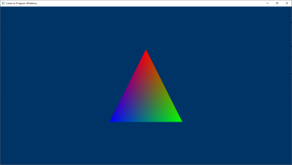

# 1 Triangle

Simple DirectX application. 

## Init Pipeline
1. Enable Debug layer
2. Create The Device (Device is used to check feature support, and create all other  Direct3D  interface  objects  like  resources,  views,  and  command  lists)
3. Describe and create the command queue (The  CPU  submits  commands  to  the  queue  through the Direct3D API using command lists)
4. Describe and create the swap chain
5. Create descriptor heaps. A descriptor heap can be thought of as an array of descriptors. Where each descriptor fully describes an object to the GPU
   1. Describe and create a render target view (RTV) descriptor heap
6. Create frame resources
   1. Create a RTV for each frame
7. Create A command allocator, manages the underlying storage for command listsand bundles
8. Create A bundle allocator. We can store commands in the bundle.

## Load Assets
1. Create an empty root signature.  A graphics root signature defines what resources are bound to the graphics pipeline
2. Create the pipeline state, which includes compiling and loading shaders
   1. Compile and load shaders
   2. Define the vertex input layout
   3. Describe and create the graphics pipeline state object (PSO)
3. Create the command list
4. Create the vertex buffer
   1. Define the geometry for a triangle
   2. Create Upload heap for the CPU to write
   3. Create Default heap, the actual buffer resource
   4. Copy the triangle data to the vertex buffer. Copy data from upload heap to Default heap
   5. 12.5 Initialize the vertex buffer view.
5. Create and record the bundle
6. Create synchronization objectsand wait until assets have been uploaded to the GPU